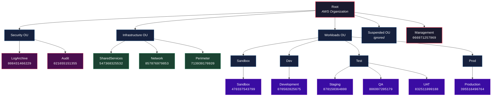

# Account Structure & Organizational Units

```mermaid
graph TD
    classDef root fill:#1a1a2e,stroke:#e94560,color:#fff,stroke-width:2px
    classDef ou fill:#16213e,stroke:#0f3460,color:#fff,stroke-width:2px
    classDef account fill:#0f3460,stroke:#53a8b6,color:#fff,stroke-width:1px
    classDef security fill:#4a0e4e,stroke:#e94560,color:#fff,stroke-width:1px
    classDef infra fill:#1b4332,stroke:#52b788,color:#fff,stroke-width:1px
    classDef workload fill:#3a0ca3,stroke:#7209b7,color:#fff,stroke-width:1px
    classDef suspended fill:#495057,stroke:#6c757d,color:#fff,stroke-width:1px

    ROOT["Root<br/><i>AWS Organization</i>"]:::root

    OU_SEC["Security OU"]:::ou
    OU_INFRA["Infrastructure OU"]:::ou
    OU_WORK["Workloads OU"]:::ou
    OU_SUSP["Suspended OU<br/><i>ignored</i>"]:::ou

    ROOT --> MGMT["Management<br/><code>066971257969</code>"]:::root
    ROOT --> OU_SEC
    ROOT --> OU_INFRA
    ROOT --> OU_WORK
    ROOT --> OU_SUSP

    OU_SEC --> LOG["LogArchive<br/><code>808431466229</code>"]:::security
    OU_SEC --> AUDIT["Audit<br/><code>021655151355</code>"]:::security

    OU_INFRA --> SHARED["SharedServices<br/><code>547368325532</code>"]:::infra
    OU_INFRA --> NET["Network<br/><code>857876979853</code>"]:::infra
    OU_INFRA --> PERIM["Perimeter<br/><code>713939170920</code>"]:::infra

    OU_WORK --> OU_SANDBOX["Sandbox"]:::ou
    OU_WORK --> OU_DEV["Dev"]:::ou
    OU_WORK --> OU_TEST["Test"]:::ou
    OU_WORK --> OU_PROD["Prod"]:::ou

    OU_SANDBOX --> SANDBOX["Sandbox<br/><code>470337543799</code>"]:::workload
    OU_DEV --> DEV["Development<br/><code>070502825675</code>"]:::workload
    OU_TEST --> STAGING["Staging<br/><code>870150364800</code>"]:::workload
    OU_TEST --> QA["QA<br/><code>806997205179</code>"]:::workload
    OU_TEST --> UAT["UAT<br/><code>832511099188</code>"]:::workload
    OU_PROD --> PROD["Production<br/><code>395516496764</code>"]:::workload
```
