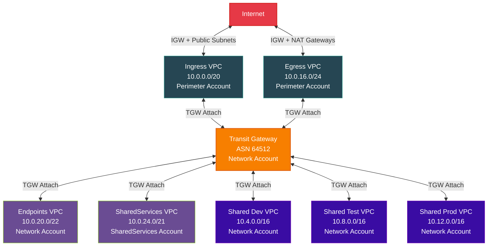
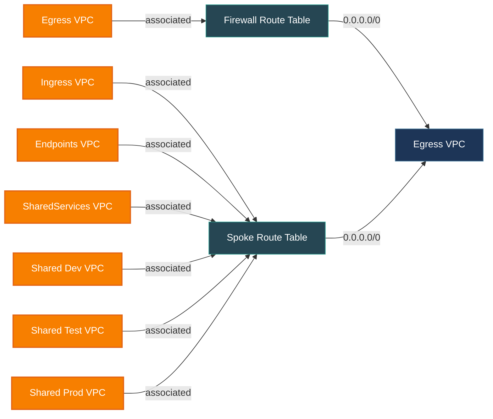

# Network Architecture — Shared VPC Model (No Inspection)

## High-Level Traffic Flow

## TGW Route Tables

## VPC Detail — Subnet Layout

| VPC | Account | CIDR | Subnets per AZ | Key Features |
|-----|---------|------|----------------|--------------|
| Ingress | Perimeter | 10.0.0.0/20 | FW, Public, TGW | Internet Gateway, inbound traffic |
| Egress | Perimeter | 10.0.16.0/24 | FW, Public, TGW | Internet Gateway, 2x NAT Gateways |
| Endpoints | Network | 10.0.20.0/22 | Endpoint, TGW | Central interface endpoints: ec2, ecr, kms, logs, ssm, monitoring |
| SharedServices | SharedServices | 10.0.24.0/21 | Web, App, Data, TGW | Org-wide shared services |
| Shared Dev | Network | 10.4.0.0/16 | TGW + custom | Subnets shared via RAM to Dev accounts |
| Shared Test | Network | 10.8.0.0/16 | TGW + custom | Subnets shared via RAM to Test accounts |
| Shared Prod | Network | 10.12.0.0/16 | TGW + custom | Subnets shared via RAM to Prod accounts |
