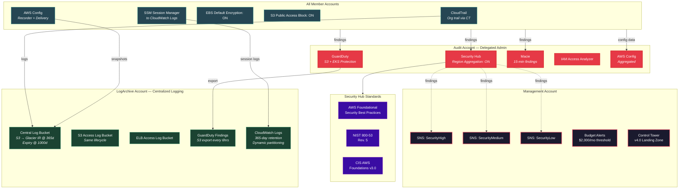

# Security Architecture — Hub-and-Spoke Model

```mermaid
graph TB
    classDef hub fill:#e63946,stroke:#d62828,color:#fff,stroke-width:2px
    classDef spoke fill:#264653,stroke:#2a9d8f,color:#fff,stroke-width:1px
    classDef service fill:#6a4c93,stroke:#b5838d,color:#fff,stroke-width:1px
    classDef logging fill:#1b4332,stroke:#52b788,color:#fff,stroke-width:1px
    classDef mgmt fill:#1a1a2e,stroke:#e94560,color:#fff,stroke-width:2px
    classDef standard fill:#3a0ca3,stroke:#7209b7,color:#fff,stroke-width:1px

    subgraph DELEGATED["Audit Account — Delegated Admin"]
        direction TB
        SECHUB["Security Hub<br/><i>Region Aggregation: ON</i>"]:::hub
        GD["GuardDuty<br/><i>S3 + EKS Protection</i>"]:::hub
        MACIE["Macie<br/><i>15-min findings</i>"]:::hub
        AA["IAM Access Analyzer"]:::hub
        CONFIG_AGG["AWS Config<br/><i>Aggregated</i>"]:::hub
    end

    subgraph STANDARDS["Security Hub Standards"]
        direction LR
        FSBP["AWS Foundational<br/>Security Best Practices"]:::standard
        NIST["NIST 800-53<br/>Rev. 5"]:::standard
        CIS3["CIS AWS<br/>Foundations v3.0"]:::standard
    end

    subgraph MGMT_ACCT["Management Account"]
        direction TB
        SNS_HIGH["SNS: SecurityHigh"]:::mgmt
        SNS_MED["SNS: SecurityMedium"]:::mgmt
        SNS_LOW["SNS: SecurityLow"]:::mgmt
        BUDGET["Budget Alerts<br/>$2,000/mo threshold"]:::mgmt
        CT["Control Tower<br/>v4.0 Landing Zone"]:::mgmt
    end

    subgraph LOG_ACCT["LogArchive Account — Centralized Logging"]
        direction TB
        CENTRAL_LOGS["Central Log Bucket<br/><i>S3 → Glacier IR @ 365d</i><br/><i>Expiry @ 1000d</i>"]:::logging
        ACCESS_LOGS["S3 Access Log Bucket<br/><i>Same lifecycle</i>"]:::logging
        ELB_LOGS["ELB Access Log Bucket"]:::logging
        GD_EXPORT["GuardDuty Findings<br/><i>S3 export every 6hrs</i>"]:::logging
        CW_LOGS["CloudWatch Logs<br/><i>365-day retention</i><br/><i>Dynamic partitioning</i>"]:::logging
    end

    subgraph MEMBER["All Member Accounts"]
        direction TB
        CT_TRAIL["CloudTrail<br/><i>Org trail via CT</i>"]:::spoke
        CONFIG_REC["AWS Config<br/><i>Recorder + Delivery</i>"]:::spoke
        EBS_ENC["EBS Default Encryption: ON"]:::spoke
        S3_BLOCK["S3 Public Access Block: ON"]:::spoke
        SSM["SSM Session Manager<br/><i>to CloudWatch Logs</i>"]:::spoke
    end

    SECHUB --> STANDARDS
    SECHUB -.->|"findings"| SNS_HIGH
    SECHUB -.->|"findings"| SNS_MED
    SECHUB -.->|"findings"| SNS_LOW

    MEMBER -->|"findings"| SECHUB
    MEMBER -->|"findings"| GD
    MEMBER -->|"findings"| MACIE
    MEMBER -->|"config data"| CONFIG_AGG

    CT_TRAIL -->|"logs"| CENTRAL_LOGS
    GD -->|"export"| GD_EXPORT
    SSM -->|"session logs"| CW_LOGS
    CONFIG_REC -->|"snapshots"| CENTRAL_LOGS
```
