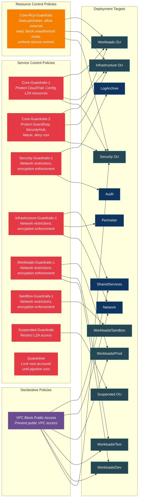

# SCP & Guardrail Mapping

```mermaid
graph LR
    classDef scp fill:#e63946,stroke:#d62828,color:#fff,stroke-width:1px
    classDef rcp fill:#f77f00,stroke:#e36414,color:#fff,stroke-width:1px
    classDef dp fill:#6a4c93,stroke:#b5838d,color:#fff,stroke-width:1px
    classDef target fill:#264653,stroke:#2a9d8f,color:#fff,stroke-width:1px
    classDef account fill:#0f3460,stroke:#53a8b6,color:#fff,stroke-width:1px

    subgraph SCPS["Service Control Policies"]
        direction TB
        SCP1["Core-Guardrails-1<br/><i>Protect CloudTrail, Config,<br/>LZA resources</i>"]:::scp
        SCP2["Core-Guardrails-2<br/><i>Protect GuardDuty, SecurityHub,<br/>Macie, deny root</i>"]:::scp
        SCP3["Security-Guardrails-1<br/><i>Network restrictions,<br/>encryption enforcement</i>"]:::scp
        SCP4["Infrastructure-Guardrails-1<br/><i>Network restrictions,<br/>encryption enforcement</i>"]:::scp
        SCP5["Workloads-Guardrails-1<br/><i>Network restrictions,<br/>encryption enforcement</i>"]:::scp
        SCP6["Sandbox-Guardrails-1<br/><i>Network restrictions,<br/>encryption enforcement</i>"]:::scp
        SCP7["Suspended-Guardrails<br/><i>Restrict LZA access</i>"]:::scp
        SCP8["Quarantine<br/><i>Lock new accounts<br/>until pipeline runs</i>"]:::scp
    end

    subgraph RCPS["Resource Control Policies"]
        RCP1["Core-Rcp-Guardrails<br/><i>Data perimeter: allow external<br/>read, block unauthorized mods,<br/>enforce secure comms</i>"]:::rcp
    end

    subgraph DPS["Declarative Policies"]
        DP1["VPC Block Public Access<br/><i>Prevent public VPC access</i>"]:::dp
    end

    subgraph TARGETS["Deployment Targets"]
        direction TB
        T_SEC["Security OU"]:::target
        T_INFRA["Infrastructure OU"]:::target
        T_WORK["Workloads OU"]:::target
        T_SANDBOX["Workloads/Sandbox"]:::target
        T_DEV["Workloads/Dev"]:::target
        T_TEST["Workloads/Test"]:::target
        T_PROD["Workloads/Prod"]:::target
        T_SUSP["Suspended OU"]:::target
        T_AUDIT["Audit"]:::account
        T_LOG["LogArchive"]:::account
        T_NET["Network"]:::account
        T_PERIM["Perimeter"]:::account
        T_SHARED["SharedServices"]:::account
    end

    SCP1 --> T_SEC & T_INFRA & T_WORK
    SCP2 --> T_SEC & T_INFRA & T_WORK
    SCP3 --> T_AUDIT & T_LOG
    SCP4 --> T_NET & T_PERIM & T_SHARED
    SCP5 --> T_DEV & T_TEST & T_PROD
    SCP6 --> T_SANDBOX
    SCP7 --> T_SUSP

    RCP1 --> T_SEC & T_INFRA & T_WORK

    DP1 --> T_SEC & T_DEV & T_TEST & T_PROD & T_NET & T_SHARED
```
