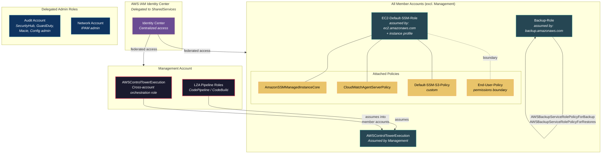

# IAM Cross-Account Trust & Role Model

```mermaid
graph TB
    classDef mgmt fill:#1a1a2e,stroke:#e94560,color:#fff,stroke-width:2px
    classDef role fill:#264653,stroke:#2a9d8f,color:#fff,stroke-width:1px
    classDef idc fill:#6a4c93,stroke:#b5838d,color:#fff,stroke-width:1px
    classDef member fill:#0f3460,stroke:#53a8b6,color:#fff,stroke-width:1px
    classDef policy fill:#e9c46a,stroke:#f4a261,color:#000,stroke-width:1px

    subgraph IDC["AWS IAM Identity Center<br/><i>Delegated to SharedServices</i>"]
        direction TB
        SSO["Identity Center<br/><i>Centralized access</i>"]:::idc
    end

    subgraph MGMT_ACCT["Management Account"]
        direction TB
        CT_EXEC["AWSControlTowerExecution<br/><i>Cross-account orchestration role</i>"]:::mgmt
        LZA_ROLE["LZA Pipeline Roles<br/><i>CodePipeline / CodeBuild</i>"]:::mgmt
    end

    subgraph ALL_MEMBERS["All Member Accounts (excl. Management)"]
        direction TB
        CT_EXEC_MEMBER["AWSControlTowerExecution<br/><i>Assumed by Management</i>"]:::role
        BACKUP_ROLE["Backup-Role<br/><i>assumed by: backup.amazonaws.com</i>"]:::role
        EC2_SSM["EC2-Default-SSM-Role<br/><i>assumed by: ec2.amazonaws.com</i><br/><i>+ instance profile</i>"]:::role

        subgraph POLICIES["Attached Policies"]
            P1["AmazonSSMManagedInstanceCore"]:::policy
            P2["CloudWatchAgentServerPolicy"]:::policy
            P3["Default-SSM-S3-Policy<br/><i>custom</i>"]:::policy
            P4["End-User-Policy<br/><i>permissions boundary</i>"]:::policy
        end
    end

    subgraph DELEGATED_ROLES["Delegated Admin Roles"]
        direction TB
        AUDIT_ADMIN["Audit Account<br/><i>SecurityHub, GuardDuty,<br/>Macie, Config admin</i>"]:::member
        NET_ADMIN["Network Account<br/><i>IPAM admin</i>"]:::member
    end

    SSO -->|"federated access"| ALL_MEMBERS
    SSO -->|"federated access"| MGMT_ACCT

    LZA_ROLE -->|"assumes"| CT_EXEC_MEMBER
    CT_EXEC -->|"assumes into<br/>member accounts"| CT_EXEC_MEMBER

    EC2_SSM --- P1 & P2 & P3
    EC2_SSM -.-|"boundary"| P4
    BACKUP_ROLE -->|"AWSBackupServiceRolePolicyForBackup<br/>AWSBackupServiceRolePolicyForRestores"| BACKUP_ROLE
```
