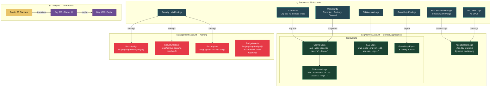

# Centralized Logging & Monitoring Architecture

```mermaid
graph TB
    classDef source fill:#264653,stroke:#2a9d8f,color:#fff,stroke-width:1px
    classDef logging fill:#1b4332,stroke:#52b788,color:#fff,stroke-width:1px
    classDef storage fill:#e9c46a,stroke:#f4a261,color:#000,stroke-width:1px
    classDef alert fill:#e63946,stroke:#d62828,color:#fff,stroke-width:1px
    classDef lifecycle fill:#6a4c93,stroke:#b5838d,color:#fff,stroke-width:1px

    subgraph SOURCES["Log Sources — All Accounts"]
        direction TB
        CT["CloudTrail<br/><i>Org trail via Control Tower</i>"]:::source
        CFG["AWS Config<br/><i>Recorder + Delivery Channel</i>"]:::source
        SSM_SESS["SSM Session Manager<br/><i>Session activity logs</i>"]:::source
        VPC_FLOW["VPC Flow Logs<br/><i>All VPCs</i>"]:::source
        GD_FIND["GuardDuty Findings"]:::source
        SH_FIND["Security Hub Findings"]:::source
        ELB_LOG["ELB Access Logs"]:::source
    end

    subgraph LOG_ARCHIVE["LogArchive Account — Central Aggregation"]
        direction TB
        subgraph S3_BUCKETS["S3 Buckets"]
            CENTRAL["Central Logs<br/><code>aws-accelerator-central-logs-*</code>"]:::logging
            ACCESS["S3 Access Logs<br/><code>aws-accelerator-s3-access-logs-*</code>"]:::logging
            ELB_BUCKET["ELB Logs<br/><code>aws-accelerator-elb-access-logs-*</code>"]:::logging
            GD_BUCKET["GuardDuty Export<br/><i>S3 every 6 hours</i>"]:::logging
        end
        CW["CloudWatch Logs<br/><i>365-day retention</i><br/><i>Dynamic partitioning</i>"]:::logging
    end

    subgraph LIFECYCLE["S3 Lifecycle — All Buckets"]
        direction LR
        L1["Day 0: S3 Standard"]:::storage
        L2["Day 365: Glacier IR"]:::lifecycle
        L3["Day 1000: Expire"]:::lifecycle
        L1 -->|"transition"| L2 -->|"expire"| L3
    end

    subgraph ALERTS["Management Account — Alerting"]
        direction TB
        SNS_H["SecurityHigh<br/><i>insightgroup-security-high@</i>"]:::alert
        SNS_M["SecurityMedium<br/><i>insightgroup-security-medium@</i>"]:::alert
        SNS_L["SecurityLow<br/><i>insightgroup-security-low@</i>"]:::alert
        BUDGET_SNS["Budget Alerts<br/><i>insightgroup-budget@</i><br/><i>50/75/80/90/100% thresholds</i>"]:::alert
    end

    CT -->|"org trail"| CENTRAL
    CFG -->|"snapshots"| CENTRAL
    SSM_SESS -->|"session logs"| CW
    VPC_FLOW -->|"flow logs"| CW
    GD_FIND -->|"export"| GD_BUCKET
    ELB_LOG --> ELB_BUCKET
    CENTRAL --> ACCESS

    SH_FIND -->|"findings"| SNS_H & SNS_M & SNS_L
```
