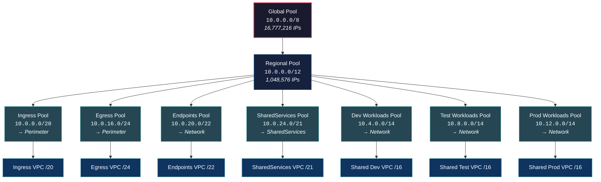

# IPAM IP Address Allocation

## Address Space Summary

| Pool | CIDR | Size | VPC | Account |
|------|------|------|-----|---------|
| Ingress | `10.0.0.0/20` | 4,096 IPs | Ingress VPC | Perimeter |
| Egress | `10.0.16.0/24` | 256 IPs | Egress VPC | Perimeter |
| Inspection | `10.0.17.0/24` | 256 IPs | *Not deployed* | — |
| Endpoints | `10.0.20.0/22` | 1,024 IPs | Endpoints VPC | Network |
| SharedServices | `10.0.24.0/21` | 2,048 IPs | SharedServices VPC | SharedServices |
| Dev Workloads | `10.4.0.0/14` | 262,144 IPs | Shared Dev VPC | Network |
| Test Workloads | `10.8.0.0/14` | 262,144 IPs | Shared Test VPC | Network |
| Prod Workloads | `10.12.0.0/14` | 262,144 IPs | Shared Prod VPC | Network |
