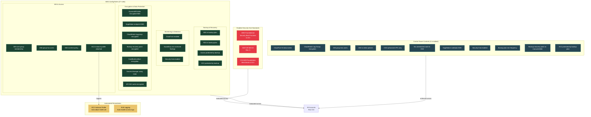

# Compliance & Security Standards Alignment

```mermaid
graph TB
    classDef framework fill:#e63946,stroke:#d62828,color:#fff,stroke-width:2px
    classDef control fill:#264653,stroke:#2a9d8f,color:#fff,stroke-width:1px
    classDef service fill:#6a4c93,stroke:#b5838d,color:#fff,stroke-width:1px
    classDef config fill:#1b4332,stroke:#52b788,color:#fff,stroke-width:1px
    classDef remediation fill:#e9c46a,stroke:#f4a261,color:#000,stroke-width:1px

    subgraph FRAMEWORKS["Enabled Security Hub Standards"]
        direction LR
        FSBP["AWS Foundational<br/>Security Best Practices<br/>v1.0.0"]:::framework
        NIST["NIST SP 800-53<br/>Rev. 5"]:::framework
        CIS["CIS AWS Foundations<br/>Benchmark v3.0.0"]:::framework
    end

    subgraph CT_CONTROLS["Control Tower Controls (11 enabled)"]
        direction TB
        CTC1["CloudTrail S3 data events"]:::control
        CTC2["CloudWatch Log Group encryption"]:::control
        CTC3["IAM group has users"]:::control
        CTC4["IAM no inline policies"]:::control
        CTC5["IGW authorized VPC only"]:::control
        CTC6["No unrestricted route to IGW"]:::control
        CTC7["SageMaker notebook KMS"]:::control
        CTC8["Security Hub enabled"]:::control
        CTC9["Backup plan min frequency"]:::control
        CTC10["Backup recovery point no manual delete"]:::control
        CTC11["EC2 protected by backup plan"]:::control
    end

    subgraph CONFIG_RULES["AWS Config Rules (27 rules)"]
        direction TB
        subgraph MONITORING["Monitoring & Detection"]
            CR1["CloudTrail enabled"]:::config
            CR2["GuardDuty non-archived findings"]:::config
            CR3["Security Hub enabled"]:::config
        end
        subgraph ENCRYPTION["Encryption & Data Protection"]
            CR4["DynamoDB table encrypted KMS"]:::config
            CR5["SageMaker endpoint KMS"]:::config
            CR6["CloudWatch log group encrypted"]:::config
            CR7["Backup recovery point encrypted"]:::config
            CR8["CodeBuild artifact encryption"]:::config
            CR9["Secrets Manager using CMK"]:::config
            CR10["API GW cache encrypted"]:::config
        end
        subgraph IAM_RULES["IAM & Access"]
            CR11["IAM user group membership"]:::config
            CR12["IAM group has users"]:::config
            CR13["IAM no inline policy"]:::config
            CR14["EC2 instance profile attached"]:::config
        end
        subgraph BACKUP_RULES["Backup & Recovery"]
            CR15["EBS in backup plan"]:::config
            CR16["RDS in backup plan"]:::config
            CR17["Aurora protected by backup"]:::config
            CR18["EC2 protected by backup"]:::config
        end
    end

    subgraph AUTO_REMEDIATION["Automated Remediation"]
        direction LR
        REM1["EC2 Instance Profile<br/><i>Auto-attach SSM role</i>"]:::remediation
        REM2["ELB Logging<br/><i>Auto-enable access logs</i>"]:::remediation
    end

    FRAMEWORKS -->|"evaluated across"| ALL["All Accounts<br/><i>Root OU</i>"]
    CONFIG_RULES -->|"evaluated across"| ALL
    CT_CONTROLS -->|"enforced across"| ALL
    CR14 -->|"triggers"| REM1
```
