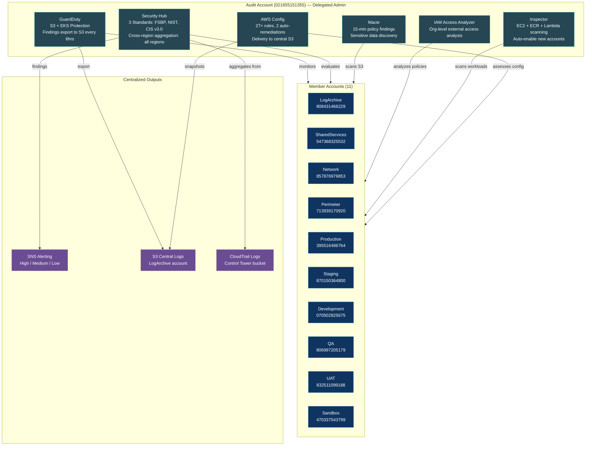

# Security Services Organization-Wide Deployment

## Service Enrollment Summary

| Service | Delegated Admin | Member Accounts | Auto-Enroll New Accounts |
|---|---|---|---|
| GuardDuty | Audit (021655151355) | All 11 | Yes |
| Security Hub | Audit (021655151355) | All 11 | Yes |
| Macie | Audit (021655151355) | All 11 | Yes |
| Inspector | Audit (021655151355) | All 11 | Yes |
| IAM Access Analyzer | Audit (021655151355) | Org-level | Yes |
| AWS Config | Audit (021655151355) | All 11 | Yes |

## Security Hub Standards

| Standard | Scope | Status |
|---|---|---|
| AWS Foundational Security Best Practices v1.0.0 | All accounts (Root OU) | Enabled |
| NIST SP 800-53 Rev 5 | All accounts (Root OU) | Enabled |
| CIS AWS Foundations Benchmark v3.0.0 | All accounts (Root OU) | Enabled |
